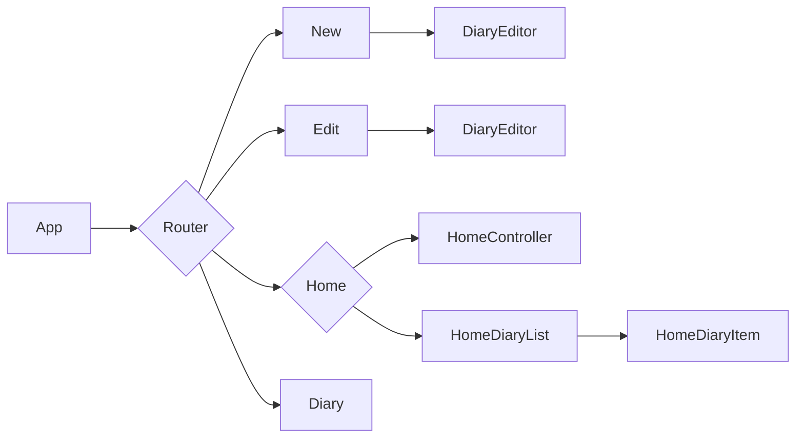

<p id="top" align="center"></p>
<br/>

## 목차

1. [📋소개 및 개요](#1장.-소개-및-개요)
    * 배포 URL
    * 프로젝트 기간
    * 프로젝트 소개
    * 실행 GIF
    * 사용 기술
2. [📁프로젝트 구조](#2장.-프로젝트-구조)
    * 컴포넌트 구조
    * 디렉토리 구조
3. [⚒️리팩토링](#3장.-리팩토링)
    * React.memo로 컴포넌트 리렌더링 방지
    * SEO를 위한 메타 데이터 수정
4. [⚠️미해결 이슈 & 개선 가능 사항](#4장.-미해결-이슈-&-개선-가능-사항)
<br/>


## <a id="1장.-소개-및-개요">1장. 소개 및 개요<a/>

### 소개

#### 배포 URL
[나만의 감성 일기장 바로가기](https://jxxunnn-diary.netlify.app/ "일기 쓰러 가기")

#### 프로젝트 기간

2023.02.01 ~ 2023.02.07 (이후 리팩토링 진행 중)

#### 프로젝트 소개

생각을 정리하거나 흔적을 남기기 위해 다이어리를 쓰는 것은 중요하지만 바쁜 일상 속에서 매일 일기를 쓰기란 어렵습니다. 그러나 꼭 볼펜으로 다이어리를 작성할 필요는 없습니다.

<br/>

감성 일기장은 쉽게 빠른 글을 작성하고 그날의 감정을 함께 기록할 수 있는 온라인 일기장입니다. 


#### 실행 gif

|새 일기 쓰기|일기 수정하기|정렬하기|
|:-:|:-:|:-:|
| |||

#### 사용 기술

`TypeScript`, `React`, `styled-component`, `ESLint`, `Vite`
```json
"dependencies": {
    "@types/react-router-dom": "^5.3.3",
    "react": "^18.2.0",
    "react-dom": "^18.2.0",
    "react-router-dom": "^6.8.0",
    "styled-components": "^5.3.6",
    "styled-reset": "^4.4.5"
  },
  "devDependencies": {
    "@types/react": "^18.0.26",
    "@types/react-dom": "^18.0.9",
    "@types/styled-components": "^5.1.26",
    "@typescript-eslint/eslint-plugin": "^5.50.0",
    "@typescript-eslint/parser": "^5.50.0",
    "@vitejs/plugin-react": "^3.0.0",
    "eslint": "^8.33.0",
    "eslint-config-naver": "^2.1.0",
    "eslint-config-prettier": "^8.6.0",
    "eslint-plugin-react": "^7.32.2",
    "eslint-plugin-react-hooks": "^4.6.0",
    "typescript": "^4.9.3",
    "vite": "^4.0.0"
  }
  ```
  
<br/>
 <p align="right"><a href="#top">(⬆️ Top)</a></p>
 
 <br/>
 <br/>

## <a id="2장.-프로젝트-구조">2장. 프로젝트 구조<a/>

### 컴포넌트 구조



### 디렉토리 구조

```
project-diary-front
├─ .eslintignore
├─ .eslintrc.json
├─ index.html
├─ package-lock.json
├─ package.json
├─ public
├─ README.md
├─ src
│  ├─ App.tsx
│  ├─ assets // 프로젝트에 사용된 이미지, 폰트 파일 저장
│  │  ├─ fonts
│  │  └─ images
│  ├─ components // 재사용 가능한 컴포넌트 저장
│  │  ├─ Common
│  │  ├─ Diary
│  │  ├─ Edit
│  │  ├─ Home
│  │  ├─ New
│  │  └─ Router
│  ├─ hooks // 커스텀 훅 저장
│  ├─ main.tsx
│  ├─ pages // 라우팅을 적용할 페이지 컴포넌트 저장
│  │  ├─ Diary
│  │  ├─ Edit
│  │  ├─ Home
│  │  └─ New
│  ├─ styles // 공통으로 사용하는 css 파일 저장
│  ├─ types // 공통으로 사용하는 type 저장
│  ├─ utils
│  └─ vite-env.d.ts
├─ tsconfig.json
├─ tsconfig.node.json
└─ vite.config.ts

```
<br/>
 <p align="right"><a href="#top">(⬆️ Top)</a></p>

 <br/>
 <br/>
 
 ## <a id="3장.-리팩토링">3장. 리팩토링<a/>

 - <a href="https://github.com/Jxxunnn/project-diary-front/issues/1">컴포넌트 리렌더링 방지<a/>
 - <a href="https://github.com/Jxxunnn/project-diary-front/issues/3">SEO를 위한 메타 데이터 수정<a/>
 
 <br/>
 <p align="right"><a href="#top">(⬆️ Top)</a></p>
 
<br/>

## <a id="4장.-미해결-이슈-&-개선-가능-사항">4장. 미해결 이슈 & 개선 가능 사항</a>

- [x] ~~이미지를 포함한 일기 item에 불필요한 재렌더링이 발생하고 있다. memo로 렌더링을 최소화하자.~~
- [ ] 일기의 텍스트가 길어져 해당 영역을 벗어나는 경우, 임시방편으로 slice 메서드를 사용하였다. 텍스트 생략이 자연스러워지도록 CSS ellipsis로 말줄임 처리할 예정이다.
- [ ] 시멘틱 태그가 사용되지 않은 요소들이 존재한다. 적절히 교체하고, 헤딩 태그를 추가한 후에 ir 기법으로 요소 숨김 처리 하자.
- [ ] Y축 스크롤바가 생길 시 root 컴포넌트가 좌측으로 밀려나 일관적인 UI를 보여주고 있지 않다.
- [ ] 현재 브라우저의 대화상자를 사용하고 있는데 더 나은 UX를 위해 Portal을 사용하여 나만의 Modal을 만들어보자.
- [ ] 기본적으로 CSR, SPA인 React 프로젝트를 SEO에 노출시키기 위해서는 추가적인 작업이 필요하다.
- [ ] input type date는 safari에서 작동하지 않는다.
- [ ] 절대 경로 설정하여 컴포넌트 경로를 깔끔히 관리해보자.
- [ ] 이미지 스프라이트 기법으로 여러 개의 감정 이미지를 하나의 파일로 합쳐보자.
- [ ] 현재 reducer의 로직이 App.js에 위치해있다. contexts 폴더를 새로 만들어 로직을 추상화하고 커스텀 훅으로 반환하자.
- [ ] 공통적으로 사용되는 상수들을 constants 폴더에 정의해보자.

 <br/>
 <p align="right"><a href="#top">(⬆️ Top)</a></p>

 <br/>
 <br/>
 

